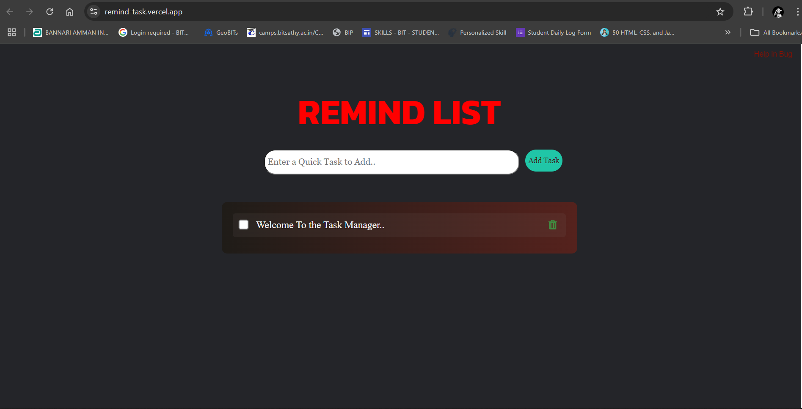

# 📝 To-Do List with Delete Button

This is a simple and efficient to-do list application that allows you to add, delete, and mark tasks as completed. The tasks are saved in the browser's local storage, ensuring they persist even after refreshing the page.

## ✨ Features

- Add new tasks 📝
- Delete tasks 🗑️
- Mark tasks as completed ✔️
- Tasks are saved in local storage 💾
- Reset all tasks 🔄

## 🛠️ Installation

1. Clone the repository:
    ```sh
    git clone https://github.com/yourusername/Quick-Task.git
    ```

2. Navigate to the project directory:
    ```sh
    cd ToDo-List
    ```

3. Open the `index.html` file in your browser to use the application.

## 📦 Dependencies

No external dependencies are required for this project. It uses vanilla JavaScript, HTML, and CSS.

## 🚀 Usage

1. **Adding a Task**:
    - Enter a task in the input field.
    - Click the "Add Task" button.

2. **Marking a Task as Completed**:
    - Click the checkbox next to the task. Completed tasks will have a line-through decoration.

3. **Deleting a Task**:
    - Click the trash icon next to the task to delete it.

4. **Resetting Tasks**:
    - Click the "Help in Bug" button to reset all tasks.

## 📸 Screenshot



## 🌐 Demo

You can see the demo of the application [here](https://remind-task.vercel.app).
